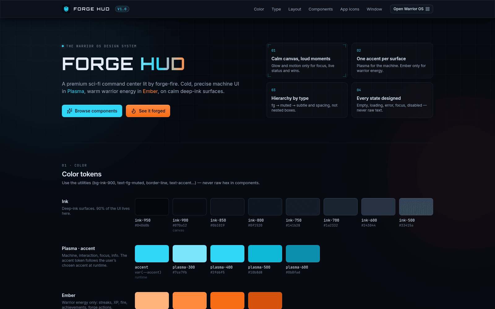
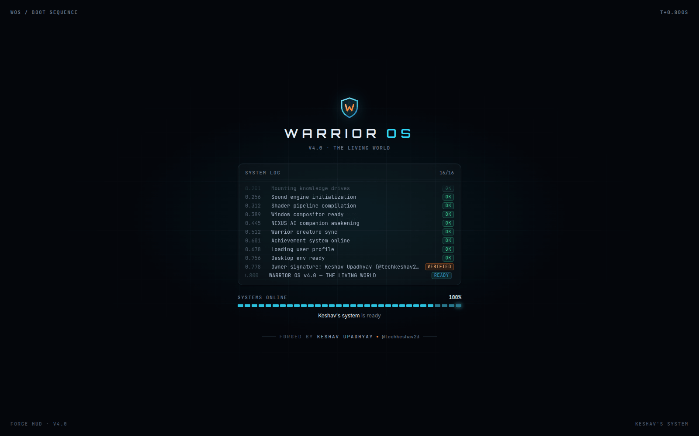
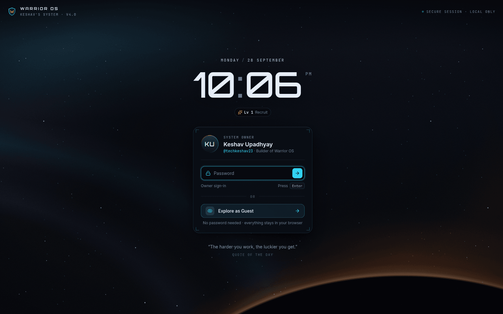
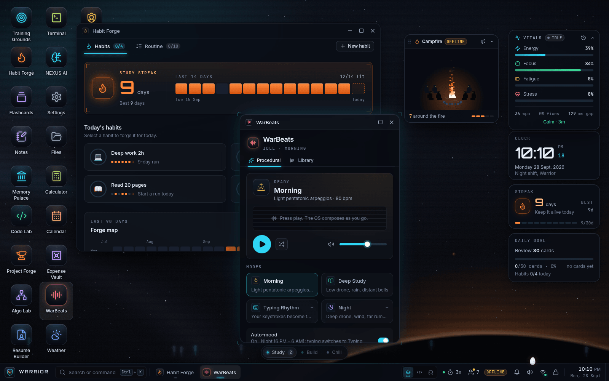
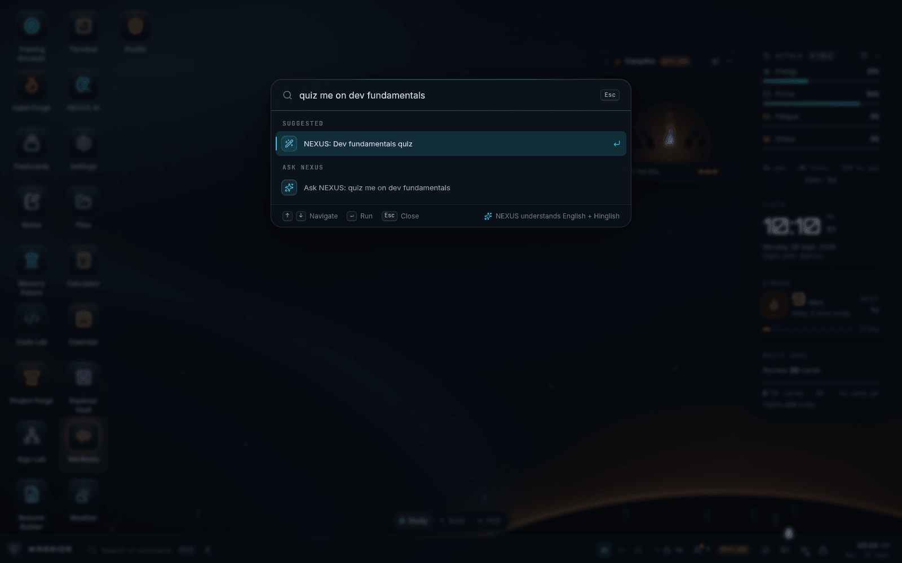
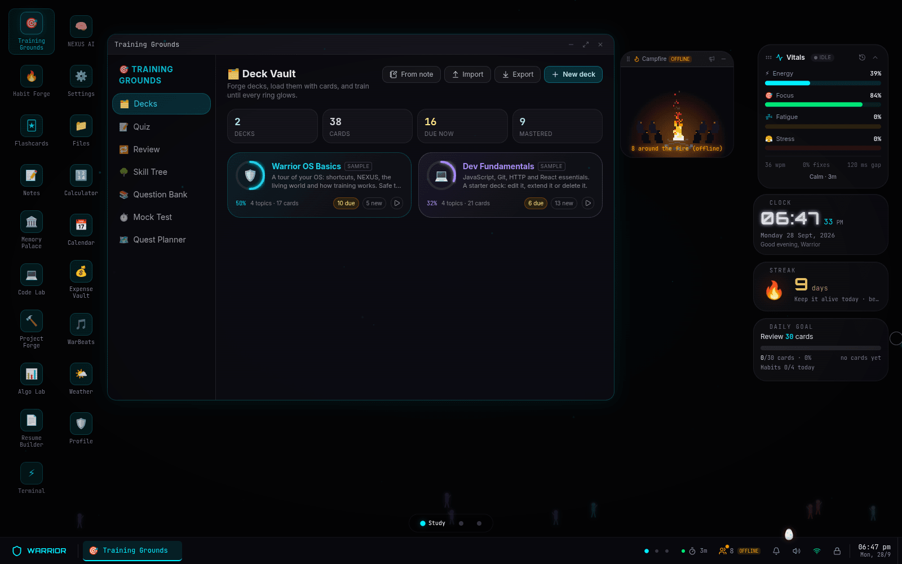
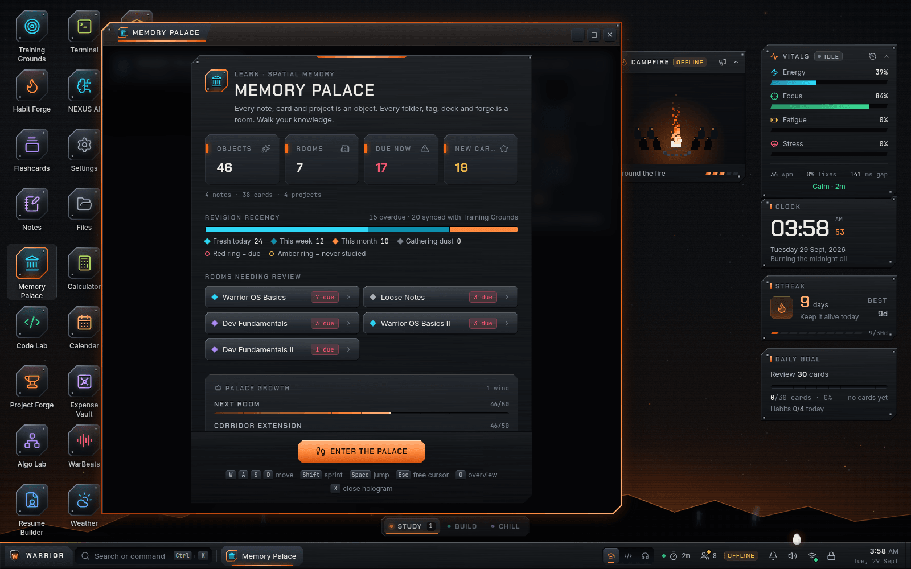
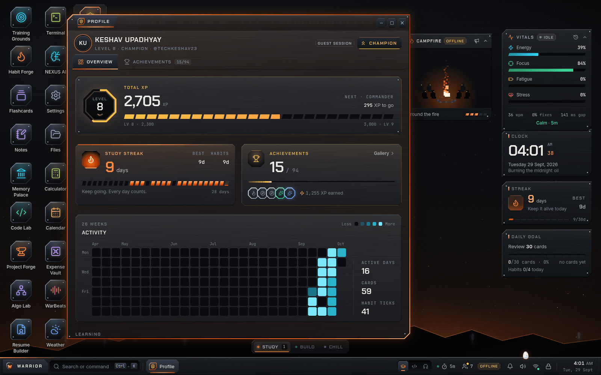
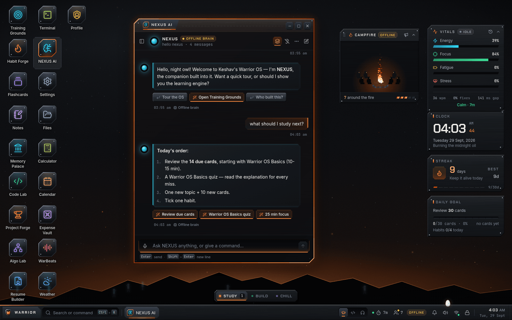

<div align="center">

# WARRIOR OS

**A sci-fi operating system that lives in the browser: my digital home, command center, discipline machine and creative playground.**

[](https://github.com/techkeshav23/Warrior-OS/actions/workflows/ci.yml)


Designed and built by **[Keshav Upadhyay](https://github.com/techkeshav23)** (@techkeshav23)

</div>

---

Warrior OS is a complete desktop operating system written in TypeScript and running in a browser tab: a cinematic boot, a lock screen, draggable armored windows, workspaces, a taskbar, a command palette that understands plain language, and 19 apps. It is my personal OS, so it knows me: a creature that grows with my work, an assistant with a personality, a world that reacts to how I study, code and rest.

**Take the tour:** open the live site, let it boot, then click **Explore as Guest** on the lock screen (or type anything and press Enter). Press **Ctrl+K** anywhere on the desktop.

> Live demo: *link goes here after the first deploy* · Deploy your own: [DEPLOY.md](DEPLOY.md)

## One OS, four sides

| | |
|---|---|
| **My digital home** | It knows its owner: my creature, my NEXUS assistant, my dreams, my stats and achievements. |
| **Sci-fi command center** | Particle-assembly boot, shader wallpapers, holographic 3D spaces, voice commands, a Dynamic Island, a palette you talk to. |
| **Discipline machine** | Habits, routines, focus timers, streaks, XP and levels, and a world that decays when I overwork. |
| **Creative playground** | Procedurally composed music, a code lab, algorithm visualizers, a terminal full of easter eggs. |

## The living world

Most "OS in a browser" projects stop at windows. These systems make this one feel alive:

- **Warrior Creature.** A digital pet that hatches from an egg on day three, feeds on the XP I earn and evolves (baby, teen, adult, legendary, mythic) into a Scholar Phoenix, Code Serpent or Warrior Dragon depending on whether I mostly study or code. It falls asleep after two idle hours.
- **Memory Palace.** A walkable 3D palace (React Three Fiber) where notes become glowing objects in themed rooms. It grows with the notes: a new room every 10, a longer corridor every 50, a new wing every 100, a Grand Hall at 500.
- **Ghost Warriors.** A pixel-art campfire that grows with the warriors around it, a leaderboard and 50-character war cries. For now it is local: the other open tabs of the same browser plus SIM-labelled warriors.
- **Reality Decay.** Work two hours without a break and the OS starts to decay: a warm colour shift, then softness, a red vignette and a heartbeat. At four hours cracks run across the screen and it forces a break, after which it repairs itself.
- **Procedural music.** Tone.js composes endless music for the moment (morning, deep study, night) and switches to a typing-rhythm mode that plays along with my keystrokes.
- **Phantom windows.** A closed window lingers as a drifting ghost for eight seconds; click it to resurrect the app with its scroll position and form input intact.
- **Typing biometrics.** Keystroke timing (never keys, never text) becomes live energy, focus, fatigue and stress readings with an hourly history.
- **Dreams.** When I come back, NEXUS dreams about yesterday: a short cinematic built from my quizzes, notes, habits and projects, played before the lock screen.
- **NEXUS.** The assistant behind it all. Gemini when a key is configured, a rule-based offline brain when not. It runs the OS from natural language in English and Hinglish ("study mode", "add expense 120 chai", "close terminal"), listens for voice, runs pomodoros and suggests what to do next. For the owner, with a model on the server (Vertex AI or a Gemini key), it becomes **JARVIS mode**: an agent with tools over my real notes, decks, habits, calendar, expenses and projects that can plan my day, quiz me from due cards, write notes and flashcards, log expenses and remember what matters (see DEPLOY.md, section 5).

## Apps

| Group | App | What it does |
|---|---|---|
| Learn | **Training Grounds** | Learn anything from your own decks. Build them in the **Decks** tab (or forge one from a note, or import JSON), then quiz yourself, review the cards due, grow the skill tree, browse the question bank, sit a timed mock test and plan with the Quest Planner. |
| | **Habit Forge** | Daily habits, routines and streaks that pay XP. |
| | **Flashcards** | Spaced-repetition flashcards from your decks. |
| | **Notes** | Markdown notes with auto-save and search. |
| | **Memory Palace** | The 3D walkable palace of your notes. |
| Build | **Code Lab** | HTML, CSS and JS playground with a sandboxed live preview. |
| | **Project Forge** | Kanban board with time tracking and shipping rewards. |
| | **Algo Lab** | Step-by-step sorting, graph and tree algorithm visualizer with compare mode. |
| | **Resume Builder** | Live-preview resume editor, auto-filled from Project Forge, PDF export. |
| | **Terminal** | A shell with its own commands (`help`, `neofetch`, `matrix`, and secrets). |
| Utility | **NEXUS AI** | Chat with NEXUS, the OS assistant. |
| | **Calendar** | Month view, agenda and reminders. |
| | **Expense Vault** | Expense log, monthly budget and spending trends. |
| | **Files** | File explorer. |
| | **Calculator** | Scientific calculator. |
| | **Settings** | Appearance, sounds, NEXUS, account (owner sync), workspaces, living-world toggles, performance (lite mode) and showcase (replay the tour, re-seed the demo data). |
| Chill | **WarBeats** | Music player with a local library, procedural music and an audio visualizer. |
| | **Weather** | Current weather and forecast. |
| | **Profile** | Level, XP, streaks, stats and the achievement gallery. |

## Tech stack

| Layer | Tools |
|---|---|
| Framework | Next.js 16 (App Router, React Compiler), React 19, TypeScript (strict) |
| UI and motion | Tailwind CSS 4, framer-motion, react-rnd, dnd-kit, lucide-react, Recharts, tsParticles, canvas-confetti |
| 3D and graphics | three.js, React Three Fiber, drei, GLSL shader wallpapers, Canvas 2D |
| Audio | Tone.js (procedural music), Howler, Web Audio, Web Speech API |
| State | zustand 5 + immer, persisted to localStorage; IndexedDB for the music library |
| Backend (optional) | Next.js route handlers: owner sync (`/api/sync`, a JSON file on the server's disk), Gemini API, OpenWeatherMap or keyless Open-Meteo |
| Quality and delivery | ESLint, Playwright end-to-end smoke test, GitHub Actions CI, Docker (Node 22 standalone) on Coolify, Vercel |

## Design system — FORGED ARMOR

Every surface, from the boot log and lock screen to the desktop and all 19 apps, is built on one design system: **FORGED ARMOR**. The OS is a warrior's kit, not a glass dashboard: **steel + ember**, with chamfered plates instead of rounded cards.

- **Steel** is the body: gunmetal plates with cut (chamfered) corners, brushed grain, bevelled edges that catch the light, rivets on the big plates and engraved labels. There is no rounded chrome; circles are kept for dots, avatars and knobs.
- **Ember** is heat: the primary action, focus, selection, streaks, XP and anything live glow molten orange.
- **Plasma** cyan is kept for tech only (NEXUS, links, data highlights, info), and **gold** marks XP and rank.

Type is Chakra Petch for display (its own letters are chamfered), Inter for UI and JetBrains Mono for data. Glow and motion are saved for focus, live status and wins, and every screen ships designed empty, loading and error states.

**Backgrounds.** Right-click the desktop and pick **Change background…** (or open Settings → Appearance) to choose a wallpaper, press `Ctrl+Alt+W` / `Ctrl+Alt+Shift+W` to step to the next or previous one, or turn on the **slideshow** to rotate them every 5, 15, 30 or 60 minutes, in order or shuffled. The forge wallpapers are **Forge Night** (the still default, and what lite mode shows), **Ember Storm**, **Molten Core**, **Battlefield Dusk** and **Steel Rain**, next to the original Starfield, Nebula, Aurora, Fluid, Neural Net and Matrix Rain. NEXUS takes them in plain language too ("wallpaper molten core").

- **Tokens:** `src/app/globals.css` (Tailwind v4 `@theme` plus the `armor-*` material and `chamfer-*` shape utilities, the source of truth) and `src/styles/tokens.ts` (the same values for canvas, charts and motion).
- **Kit:** `src/components/ui` (buttons, fields, tabs, menus, dialogs, stat tiles, empty states, `CutFrame`, `AppLayout`, `AppIcon` and more), with shared plate recipes in `src/components/ui/armor.ts`.
- **Live style guide:** the `/design-system` route (run `npm run dev`, then open [localhost:3000/design-system](http://localhost:3000/design-system)) renders every material, token, component, app icon and a sample window from the same code.
- **Rules and patterns:** [docs/design-system.md](docs/design-system.md).



## Architecture

```
src/app/page.tsx  phase machine: dream | boot -> lock -> desktop
  WorkspaceManager (Study / Build / Chill)
    Desktop (icon grid) . DesktopWidgets . WindowManager -> Window (react-rnd) -> lazy app
  Taskbar . Start menu . Command palette . Dynamic Island . Notifications
  Living-world layers: Creature . Ghosts . Decay . Phantoms . Biometrics . Music . NEXUS
src/app/api/ai       Edge route: Gemini proxy (persona server-side, validated JSON actions)
src/app/api/weather  Node route: weather proxy with cache and keyless fallback
src/app/api/sync     Node route: owner sync between devices (owner-password locked, JSON file on disk)
```

- **OS kernel.** A phase store drives boot, lock and desktop. The window manager (`useWindowStore`) owns z-order, focus, minimize and maximize, and cascade placement; the app registry (`src/data/app-registry.ts`) and `useAppStore` launch apps and enforce singletons; `useWorkspaceStore` gives each workspace its own windows, accent and wallpaper.
- **State.** Twenty-plus small zustand stores, one per concern (windows, settings, XP, creature, decay, ghosts, biometrics, NEXUS...). Cross-feature signals such as NEXUS commands and deep links travel as typed `warrior:*` DOM events, which keeps features decoupled.
- **Lazy-loaded apps.** Every app is its own client-only chunk (`next/dynamic`, `ssr: false`), fetched the first time its window opens, so three.js, Tone.js and the rest never slow down the boot.
- **Fault isolation.** Each window runs its app inside an error boundary: a crash shows a SYSTEM FAULT panel with Restart and Close, and the rest of the OS keeps running.
- **Offline-first.** All data lives in the browser first. A hand-written service worker caches the shell and static assets, the web app manifest makes it installable, and every cloud feature is optional: no keys means local mode, never a broken screen.
- **Keys stay on the server.** Gemini and weather keys are read only inside route handlers. The AI route adds a per-IP rate limit, body validation, an upstream timeout and a schema for the actions NEXUS may take.
- **Lite mode.** On modest hardware (4 GB of memory or 4 CPU threads or fewer, or reduced motion) the OS switches to CSS wallpapers and skips heavy canvases; Settings can force it on or off.

```
src/
  app/          page (phase machine), layout, manifest, API routes
  components/
    os/         kernel UI: windows, desktop, taskbar, palette, lock and boot screens
    apps/       the 19 apps, one folder each
    creature/ ghost/ decay/ phantom/ biometrics/ dream/ music/ nexus/
    effects/ wallpapers/ widgets/ achievements/ ui/
  stores/       zustand stores
  lib/          engines: procedural music, ghost presence, owner sync, NEXUS, algorithms
  data/         app registry, decks, achievements, NEXUS personality
tests/e2e/      Playwright smoke test
```

## Run locally

Requires Node.js 20.9 or newer (22 recommended).

```bash
git clone https://github.com/techkeshav23/Warrior-OS.git
cd Warrior-OS
npm install
cp .env.example .env.local   # optional: every key is optional
npm run dev                  # http://localhost:3000
```

| Script | Does |
|---|---|
| `npm run dev` | Development server |
| `npm run build` / `npm run start` | Production build and server |
| `npm run lint` | ESLint |
| `npm run test:e2e` | Playwright smoke test (run `npm run build` first) |

Without any keys everything runs locally: NEXUS answers with its offline brain, weather comes from Open-Meteo, Ghost Warriors is a local campfire. Set a temporary `OWNER_PASSWORD` on the server to turn on **owner sync**: the first sign-in asks you to choose your own password, and unlocking any device with it brings your data along. [DEPLOY.md](DEPLOY.md) covers Docker / Coolify, Vercel, owner sync and every environment variable. Hosting anywhere other than Vercel? Set `NEXT_PUBLIC_SITE_URL` to your public origin before building, or link previews point at `localhost`.

## Keyboard shortcuts

`Ctrl` means `Cmd` on macOS.

| Shortcut | Action |
|---|---|
| `Ctrl+K` | Command palette (apps, actions, notes, or plain-language requests to NEXUS) |
| `Ctrl+1` / `Ctrl+2` / `Ctrl+3` | Study / Build / Chill workspace |
| `Ctrl+L` | Lock screen |
| `Ctrl+Alt+W` / `Ctrl+Alt+Shift+W` | Next / previous wallpaper (right-click the desktop → Change background… for the picker) |
| `Ctrl+,` | Settings |
| `Cmd+D` (macOS) / `Super+D` | Show desktop |
| `Esc` | Close the Start menu, palette or notifications; skip a dream or cinematic |
| `Ctrl+G` | Training Grounds |
| `Ctrl+.` | NEXUS AI |
| `Ctrl+Shift+M` | Memory Palace |
| `Ctrl+Shift+C` | Code Lab |
| ``Ctrl+` `` | Terminal |
| `Ctrl+M` | WarBeats |
| `Up` / `Down`, `Enter` | Move through and run palette results |
| `W A S D` / arrows, `Shift`, mouse | Walk, sprint and look around the Memory Palace (`O` overview map, `X` close a note) |

App shortcuts come from each app's `shortcut` in the registry; a browser may keep a few combinations for itself. There is also a Konami code.

## Screenshots

Captured from a guest session (demo data) at 1600×1000.

| | |
|---|---|
| <br>*Boot sequence* | <br>*Lock screen: unlock as the owner or explore as a guest* |
| <br>*Desktop: Habit Forge, WarBeats, widgets, vitals and the campfire* | <br>*Command palette talking to NEXUS* |
| <br>*Training Grounds: the Decks tab* | <br>*Memory Palace* |
| <br>*Stats Center (Profile)* | <br>*NEXUS AI planning the day's study* |

## Privacy

Typing biometrics look only at keystroke timing (never which key, never any text), ignore password and payment fields entirely, and store nothing but hourly averages. Ghost Warriors is local to your own browser for now. Everything stays in the browser unless you turn on owner sync, which copies the owner's data only to the server you deploy yourself, locked by your own owner password.

## Credits

Designed and built by **Keshav Upadhyay** ([@techkeshav23](https://github.com/techkeshav23)).
